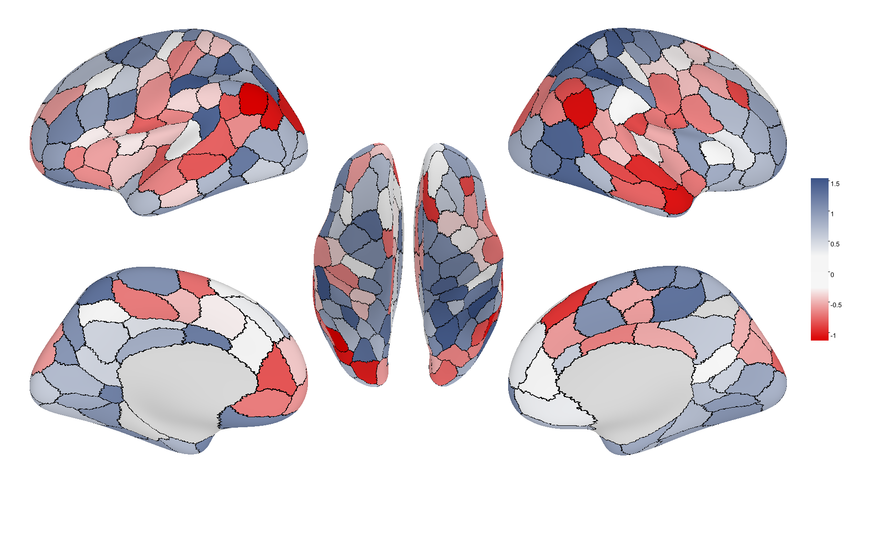
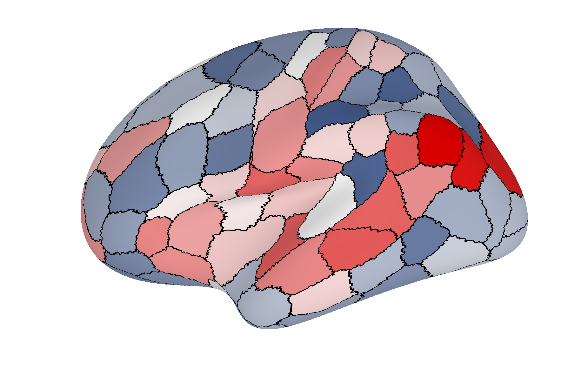
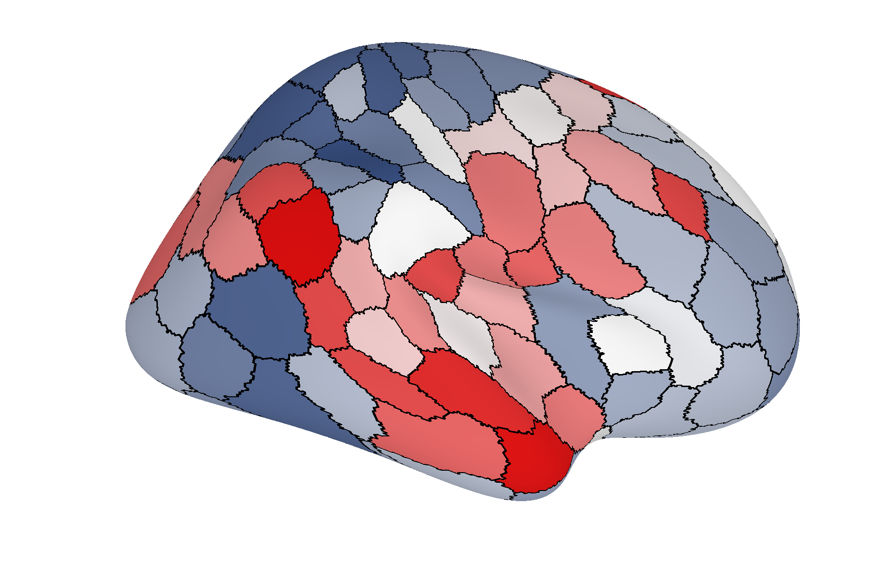
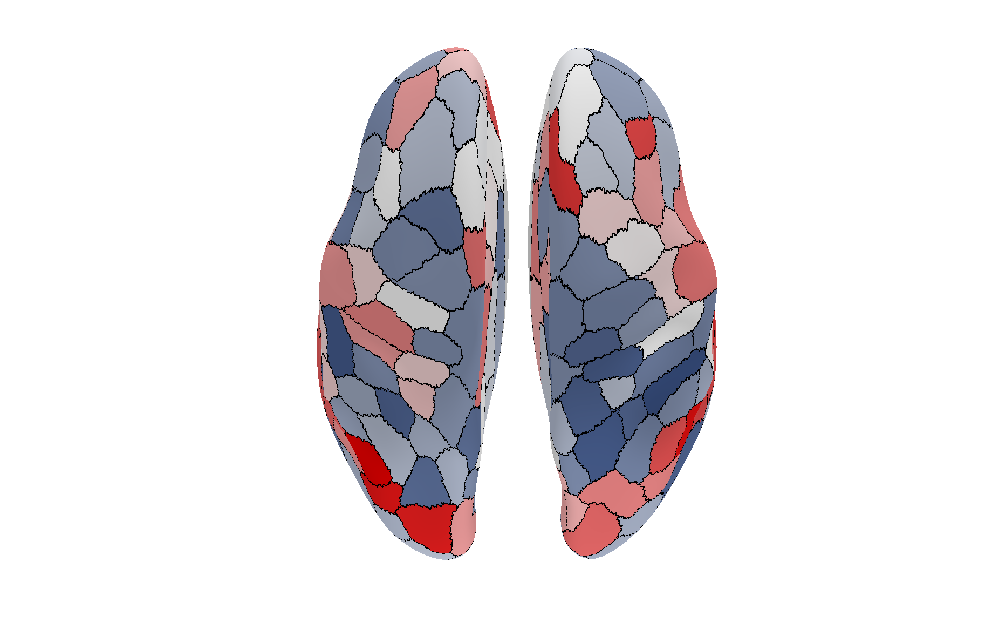

# plot-brain-surface

Rust CLI and library for plotting parcel weights on cortical brain surface meshes (GIFTI + FreeSurfer `.annot` atlases).

## Example output (Schaefer 200)

Simulated parcel weights on the Schaefer 200 atlas (`--atlas schaefer200`, `--colormap auto`):



| Left lateral | Right lateral | Both hemispheres |
|--------------|---------------|------------------|
|  |  |  |

Reproduce after installing the CLI (`cargo install plot-brain-surface` or `cargo build --release`):

```bash
plot-brain-surface plot \
  --data-dir /path/to/brain_data \
  --weights assets/example/weights_schaefer200.csv \
  --name schaefer200_demo \
  --out-dir assets/examples \
  --atlas schaefer200
```

Or from a local build:

```bash
cargo build --release
./target/release/plot-brain-surface plot \
  --data-dir /path/to/brain_data \
  --weights assets/example/weights_schaefer200.csv \
  --name schaefer200_demo \
  --out-dir assets/examples \
  --atlas schaefer200
```

Sample weights are included at `assets/example/weights_schaefer200.csv`. Surface mesh and annotation files are **not** bundled in this repo (too large).

## Install

### Prerequisites

Install the [Rust toolchain](https://rustup.rs/) (`rustc`, `cargo`).

### Install CLI from crates.io (recommended)

```bash
cargo install plot-brain-surface
```

This downloads crate `plot-brain-surface` v0.1.0 from [crates.io](https://crates.io/crates/plot-brain-surface) and installs the binary to:

```
~/.cargo/bin/plot-brain-surface
```

Ensure `~/.cargo/bin` is on your `PATH`:

```bash
# bash / zsh
export PATH="$HOME/.cargo/bin:$PATH"

# verify
plot-brain-surface plot --help
```

Upgrade to the latest published version:

```bash
cargo install plot-brain-surface --force
```

### Install CLI from source

```bash
git clone https://github.com/thanhvd18/plot-brain-surface-rs.git
cd plot-brain-surface-rs
cargo install --path .
```

Or build without installing globally:

```bash
cargo build --release
./target/release/plot-brain-surface plot --help
```

| Build | Binary path |
|-------|-------------|
| `cargo install --path .` | `~/.cargo/bin/plot-brain-surface` |
| `cargo build --release` | `target/release/plot-brain-surface` |
| `cargo build` (debug) | `target/debug/plot-brain-surface` |

### Use as a Rust library

Add the dependency from crates.io:

```bash
cargo add plot-brain-surface
```

Or in `Cargo.toml`:

```toml
[dependencies]
plot-brain-surface = "0.1"
```

## Quick start

```bash
plot-brain-surface plot \
  --data-dir /path/to/brain_data \
  --weights /path/to/weights.csv \
  --name subject01 \
  --out-dir ./output
```

Or set the data directory once:

```bash
export PLOT_BRAIN_SURFACE_DATA_DIR=/path/to/brain_data

plot-brain-surface plot \
  --weights weights.csv \
  --name subject01 \
  --out-dir ./output
```

## Required data files

Put all files below in `--data-dir` (or `PLOT_BRAIN_SURFACE_DATA_DIR`).

**Surface meshes (GIFTI):**

- `lh.inflated.freesurfer.gii`
- `rh.inflated.freesurfer.gii`
- `mesh.inflated.freesurfer.gii`

**Atlas annotations** (depends on `--atlas`):

| `--atlas` | Left / right `.annot` files |
|-----------|----------------------------|
| `schaefer200` (default) | `lh.Schaefer2018_200Parcels_7Networks_order.annot`, `rh.Schaefer2018_200Parcels_7Networks_order.annot` |
| `schaefer100` | `lh.Schaefer2018_100Parcels_7Networks_order.annot`, `rh.Schaefer2018_100Parcels_7Networks_order.annot` |
| `hcp_mmp` | `lh.HCPMMP1.annot`, `rh.HCPMMP1.annot` |
| `brodmann` | `lh.PALS_B12_Brodmann.annot`, `rh.PALS_B12_Brodmann.annot` |

The tool does not download mesh or atlas data automatically.

## Weights CSV

CSV must have a header row. Values are read from one of:

- column `cortical_thickness`
- column `weight`
- the only column, if there is just one

Row count = **interleaved LH/RH parcel pairs** (2 values per parcel index):

| Atlas | CSV rows (including header) |
|-------|----------------------------|
| `schaefer200` | 201 (= 200 values: 100 LH + 100 RH pairs) |
| `schaefer100` | 101 |
| `hcp_mmp` | 361 |

Example (`schaefer200`):

```csv
cortical_thickness
0.69
0.97
0.99
...
```

Each pair is `[left_hemisphere, right_hemisphere]` for the same parcel index.

Special values:

- `-999` → treated as missing
- parcels 0 and 1 (non-cortical) are excluded from the color scale

## CLI options

```
plot-brain-surface plot [OPTIONS]

Required:
  --data-dir <DIR>     GIFTI meshes + .annot files (or env PLOT_BRAIN_SURFACE_DATA_DIR)
  --weights <CSV>      Parcel weights file
  --name <PREFIX>      Output filename prefix
  --out-dir <DIR>      Output directory

Optional:
  --atlas <KEY>        schaefer200 | schaefer100 | hcp_mmp | brodmann  [default: schaefer200]
  --border-atlas <KEY> Draw ROI borders from a second atlas (e.g. brodmann)
  --colormap <NAME>    auto | jet | diverging | blue | common_unique  [default: auto]
  --vmin <FLOAT>       Fixed color scale minimum
  --vmax <FLOAT>       Fixed color scale maximum
  --plot-full          Write per-hemisphere views  [default: true]
```

### Example with all common options

```bash
plot-brain-surface plot \
  --data-dir ~/data/fsaverage_surfaces \
  --weights ~/results/subject01.csv \
  --name subject01 \
  --out-dir ~/plots/subject01 \
  --atlas schaefer200 \
  --border-atlas brodmann \
  --colormap diverging \
  --vmin -0.2 \
  --vmax 0.2
```

## Output files

Written to `--out-dir` with prefix `--name`:

| File | Description |
|------|-------------|
| `{name}_color_bar.png` | Main figure (both hemispheres + color bar) |
| `{name}_color_bar.svg` | Same figure as SVG |
| `lh_lateral_{name}_0.png` | Left hemisphere, lateral view |
| `lh_medial_{name}_0.png` | Left hemisphere, medial view |
| `rh_lateral_{name}_0.png` | Right hemisphere, lateral view |
| `rh_medial_{name}_0.png` | Right hemisphere, medial view |
| `*.svg` | SVG versions of the single-view panels |

Single-view PNG/SVG files are skipped when `--plot-full false`.

## Library usage

After adding the crate (see [Use as a Rust library](#use-as-a-rust-library)):

```rust
use plot_brain_surface::{
    plot_brain_from_weights, AtlasKind, ColormapKind, PlotBrainOptions,
};

plot_brain_from_weights(&PlotBrainOptions {
    data_dir: "/path/to/data".into(),
    weights: "/path/to/weights.csv".into(),
    name: "subject01".into(),
    out_dir: "/path/to/output".into(),
    atlas: AtlasKind::Schaefer200,
    border_atlas: None,
    colormap: ColormapKind::Auto,
    vmin: None,
    vmax: None,
    plot_full: true,
})?;
```

## License

MIT
